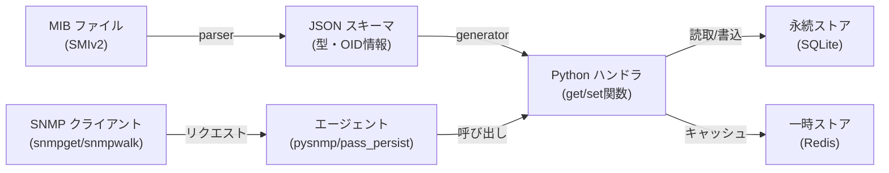
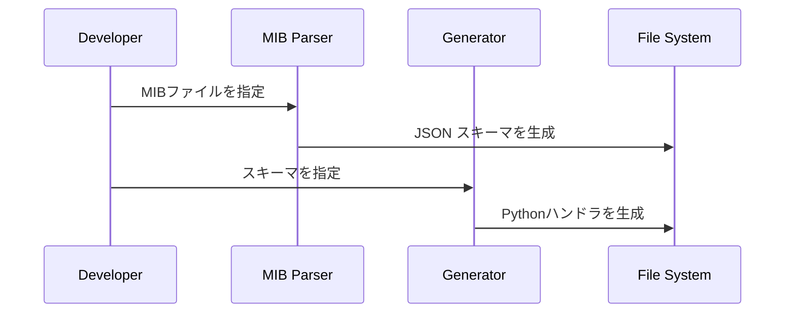
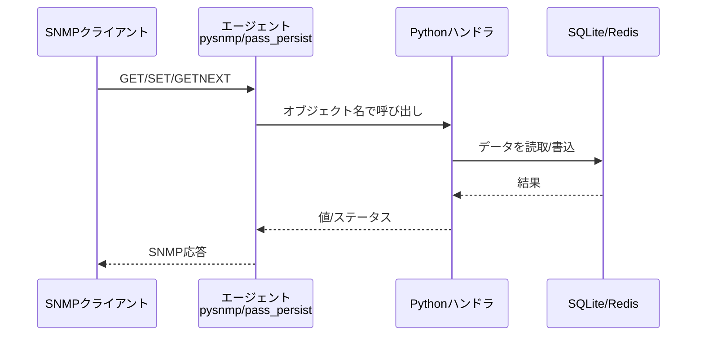

# システム概要とアーキテクチャ

## 🎯 プロジェクトの目的

MIB（Management Information Base）定義から、自動的にSNMPエージェントハンドラを生成し、データを永続化・管理するフレームワークです。開発効率と保守性を大幅に改善します。

## 📊 システムアーキテクチャ



## 🔄 データフロー

### 開発フェーズ



### 実行フェーズ



## 🏗️ 主要コンポーネント

| コンポーネント | 役割 | 技術 |
|-------------|------|------|
| **MIB Parser** | SMIv2ファイルをJSONスキーマに変換 | pysmi/テキスト解析 |
| **Generator** | スキーマからPythonハンドラを生成 | Jinja2テンプレート |
| **SQLiteAdapter** | 永続ストレージの操作 | SQLite3 + WAL |
| **RedisAdapter** | 一時キャッシュの操作 | redis-py |
| **SNMP Agent** | SNMPプロトコルの実装 | pysnmp または pass_persist |

## 📋 ワークフロー例

### 基本フロー（ローカル開発）

```bash
# 1️⃣ MIBファイルをパース
python src/mib/mib_parser.py myservice.mib > schema.json

# 2️⃣ ハンドラを生成
python src/mib/generator.py schema.json src/deploy/generated_handlers

# 3️⃣ 生成ハンドラをローカルで実行・検証
python src/runtime/agentx_demo.py myObject get
python src/runtime/agentx_demo.py myObject set 100
```

### 本番デプロイ

```bash
# 4️⃣ pass_persistでsnmpdと統合
pass_persist .1.3.6.1.4.1.XXXX python3 agentx_pass_persist.py mapping.json

# 5️⃣ SNMPクライアントからアクセス
snmpget -v3 -u admin myhost 1.3.6.1.4.1.XXXX
```

## 🔗 ディレクトリマッピング

```
src/
├── mib/
│   ├── mib_parser.py           # MIB → JSON スキーマ
│   ├── mib_parser_pysmi.py     # pysmi を使った堅牢パース
│   ├── generator.py             # JSON → Python ハンドラ
│   └── resources/
│       └── example/
│           ├── EXAMPLE-MIB      # サンプル MIB ファイル
│           └── example_schema.json
├── deploy/
│   ├── agentx_pass_persist.py  # pass_persist ヘルパー
│   ├── agentx_mapping.json     # OID ↔ ハンドラマッピング
│   └── generated_handlers/     # 生成されたハンドラ置き場
└── runtime/
    ├── agentx_demo.py           # ローカル実行・デバッグ用
    ├── pysnmp_agent.py          # pysnmp ベースエージェント
    └── persistence.py           # SQLite/Redis アダプタ
```

## 💾 データ永続化戦略

### SQLite（耐久的データ）

- **用途** - 設定値、統計データ、センサ値など、電源喪失後も保持すべきデータ
- **特性** - トランザクション対応、複雑なクエリ可能、単一ファイル
- **最適化** - WAL モード有効化、同時実行対応

### Redis（一時データ）

- **用途** - セッション情報、キャッシュ、アクティブカウンタ
- **特性** - 高速インメモリ、揮発性、シンプルなKV操作
- **活用** - DB負荷軽減、応答速度改善

## 🚀 実行パターン

### パターン1: 開発・検証（ローカル実行）

```bash
# 生成ハンドラをsrc/runtime/agentx_demo.pyで直接実行
python src/runtime/agentx_demo.py myObject get
```

**メリット** - セットアップ不要、高速デバッグ  
**デメリット** - ネットワーク経由のアクセスなし

### パターン2: プロトタイプ（pysnmp エージェント）

```bash
# pysnmp でプロトタイプSNMPエージェントを起動
python src/runtime/pysnmp_agent.py --port 161
```

**メリット** - SNMPプロトコル対応、移植性高い  
**デメリット** - Python ランタイムの実装オーバーヘッド

### パターン3: 本番（net-snmp + pass_persist）

```bash
# net-snmpのpass_persist機能で統合
pass_persist .1.3.6.1.4.1.XXXX python3 agentx_pass_persist.py
```

**メリット** - 高性能、信頼性、実績  
**デメリット** - net-snmpのセットアップ必要

## 📈 拡張ポイント

| ポイント | 現状 | 拡張案 |
|---------|------|--------|
| **型サポート** | スカラー基本型 | テーブル、複合型、SEQUENCE対応 |
| **OID生成** | 手動マッピング | MIBから自動抽出 |
| **永続化** | SQLite単一DB | 複数DB、レプリケーション |
| **エージェント** | pass_persist、pysnmp | C/C++ subagent、AgentXダイレクト |
| **セキュリティ** | 基本ACL | ポリシー管理、監査ログ |

## ⏭️ 次のステップ

1. **初心者** → [クイックスタート](03_QuickStart.md) でセットアップ
2. **開発者** → [コンポーネント詳細](04_Components.md) で実装理解
3. **運用者** → [デプロイメント](05_Deployment.md) で本番導入
4. **セキュリティ** → [セキュリティガイド](06_Security.md) で堅牢化

---

**最終更新**: 2026年8月  
**ステータス**: プロトタイプ実装中
